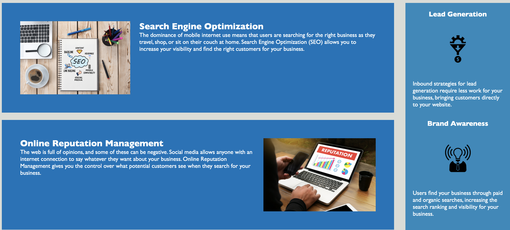
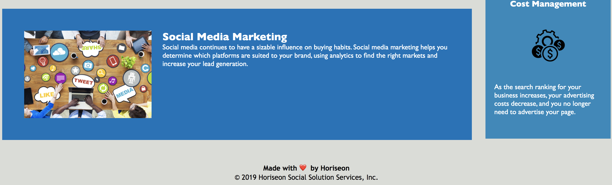

# hw1-semantic-tag

* This is a single page informative website about Horiseon Marketing Agency.

## Functionality/Design  

* Name of the website is Horiseon 

* Header links will take you to a section where it describes each content.

* Each section displays a brief summary of the content along with descriptive images 

* There are more section to the right side of the page 

## Mock-Up

The following image shows Horiseon Marketing Agency's web application  appearance and functionality: 

## Links to the deployed application

* URL of the deployed application: (https://tewol.github.io/hw1-semantic-tag/)

* URL of the GitHub repository: https://github.com/Tewol/hw1-semantic-tag

© 2021 Hewan Redie